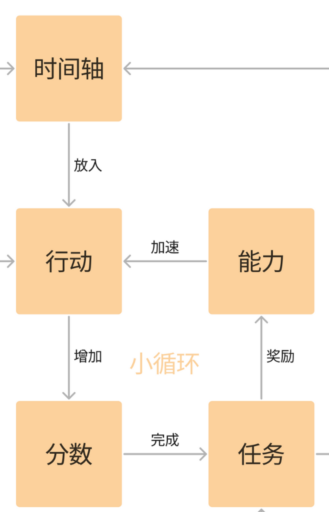

我们的游戏发布地址：https://discarder.itch.io/project-ccee。你也可以在本页面的release中下载。

我们的游戏发布b站视频链接：待审核

### 总体设计

1. 高中生的日程安排，时间非常紧凑，从早到晚都在学习
2. 努力刷题、成绩变好、能力变强、刷题更快的正反馈循环
3. 讲一个高中生接受体制教育塑造，同时努力探寻自我和世界的故事
4. 对话合理的分布在日程模拟之中
5. 各条任务线相互争夺玩家的时间资源

### 核心功能

1. 回合制
2. 往时间轴里放行动
3. 执行行动获得分数
4. 分数增加完成任务
5. 任务完成获得能力
6. 能力提高解锁行动
7. 地图和角色
8. 与角色对话
9. 对话获得新行动和任务
10. 完成任务解锁新对话
11. 对话分支、选项
12. 角色剧情线

### 功能列表

1. 时间轴系统
   1. 游戏总回合倒计时
   2. 呈现一天中的已用时间和可用时间
   3. 点击回合结束键进入下一回合，重置可用时间
2. UI系统
   1. 右侧标签栏切换「行动」、「任务」和「关系」页面
   2. 左侧状态栏显示四种「能力值」和六个「学科分数」
   3. 关系页面显示六个「关系好感度」
3. 行动系统
   1. 有分类的行动列表，按照「未完成」和「已完成」
   2. 显示行动「名称」、「耗时」、「可用次数」、「需求的能力值」和「收益的学科分数/关系好感度」
   3. 点击某个可用行动使其出现或消失在「选中行动」框中
   4. 点击按钮执行选中的行动，获得收益、消耗时间和次数
   5. 当需求不满足、剩余时间不足、可用次数不足时，行动不可用
4. 任务系统
   1. 有分类的任务列表，按照「未完成」和「已完成」
   2. 显示任务「名称」、「剩余回合」、「要求达成的目标」、「完成给予的奖励」和「失败遭受的惩罚」（TODO）
   3. 目标可能包括学科分数/关系好感度（TODO）和行动完成次数
   4. 当任务内容完成时，获得奖励（能力值增加）（TODO）
   5. 当任务时间耗尽时，获得惩罚（SAN值减少）（TODO）
5. 地图系统
   1. 展示全部地点
   2. 点击选择不同的地点
   3. 展示当前地点中的角色
   4. 点击角色进入对话（按角色名称调用）
6. 对话系统
   1. 调用DialogueManager实现
   2. 显示角色名称和说话内容，点击对话框下一条或结束
   3. 显示多个抉择语句，选择后跳转正确分支
   4. getset调用全部能力值、分数、好感度、行动和任务
7. 行动系统
   1. 执行行动后调用对话呈现行动消耗和收益
   2. 所有行动调用同一个对话「行动」，并将行动名称作为临时参数传入
   3. 增加能力反馈系数，执行行动时可以产出所需能力，公式如下
      1. 产出能力 = 行动时间（小时） * 能力反馈系数
      2. 这个值需要按概率取整，即0.5是0和1各50%，1.2是1和2按20%和80%
      3. 每次把这个值存下来方便调用（TODO）
   4. 增加可用状态，即玩家是否拥有，不可用的行动ui中不可见
   5. 当对话调用行动从不可用set为可用时，行动ui可见，且重置可用次数（TODO）
8. 任务系统
   1. 任务完成时调用对话呈现任务名称和奖励
   2. 所有任务调用同一个对话「任务」，并将任务名称作为临时参数传入
   3. 增加可用状态，即玩家是否拥有，不可用的任务ui中不可见
   4. 任务失败时成为不可用状态
   5. 当对话调用任务从不可用set为可用时，任务ui可见，且重置剩余回合（TODO）
9. 关系系统
   1. 角色出现的地点
   2. 增加次要角色，没有好感度，但有地点，可以对话
   3. 角色的完整故事线，以对话、行动、任务的组合形式出现
10. 临时功能
    1. 游戏开始时，将所有带「1」的学科行动和所有带「学校」的任务设置为可用状态

### 行动说明

1. 行动
   1. 整局游戏50回合，每回合16小时，共800小时
   2. 六科各占100小时，每小时标准收益10点分数，每科预计分数1000+
   3. 保留冗余为每科设计120小时行动，1500分为完美
   4. 每种能力预计100，共400，其中三分之一由学科行动产出，每小时标准收益0.2点能力
   5. 能力收益分配是不均衡的，从高到低为数学物理、语文化学、生物英语
   6. 此外，综合能力分数收益，数学价值超模，英语价值低模
   7. 每科行动主要分6种，除教材5级外每种3级，每级5小时，共计100小时
   8. 教材数值明显高，既产出大量分数，也均衡提高能力
   9. 其余5种数值相近，在能力分数偏重和升级前后优势期有所差异
   10. 前者区分奥赛和真题，后者区分背诵和技巧
   11. 大多数行动升级时能力产出减少、分数产出增加

### 引用

1.我们使用了godot_dialogue_manager的对话管理器。https://github.com/nathanhoad/godot_dialogue_manager

2.我们使用了openai的gpt4 api接口辅助编写代码。https://openai.com

3.我们使用了https://pollinations.ai/生成所需的美术图片

4.我们的bgm来自https://potat0master.itch.io/free-background-music-for-visual-novels-bgm-pack-1

